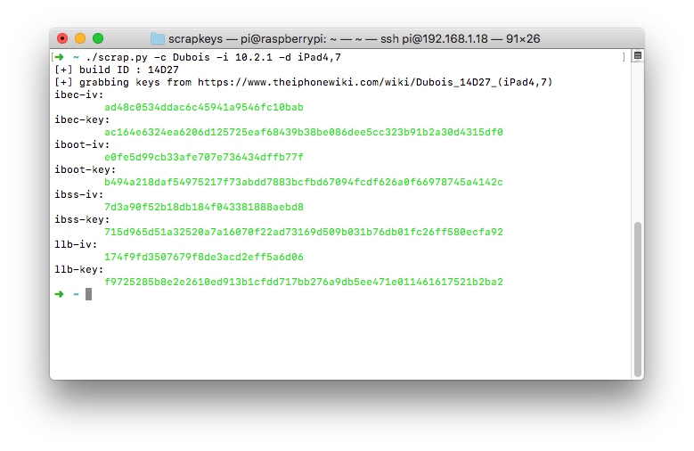
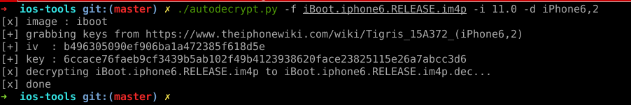

# ios-tools
Python scripts for iOS stuff

### signed.py
Check for signing status
Based on [IPSW.me](https://ipsw.me/) API

`usage: ./signed.py <device>`

example :
```
$ ./signed.py iPhone8,1
signed firmwares for iPhone8,1:
11.2.6 - 15D100
```

### ipsw-dl.py
Download and IPSW file

`usage: ./ipsw-dl.py <model> [version]`
example :
```
$ ./ipsw-dl.py iPhone8,1 11.1.2
[+] build ID : 15B202
[+] IPSW : iPhone_4.7_11.1.2_15B202_Restore.ipsw
[+] URL : http://appldnld.apple.com/ios11.1.2/091-46844-20171116-4F99614A-C9C7-11E7-8C47-8AE0F451CBCD/iPhone_4.7_11.1.2_15B202_Restore.ipsw
[+] size : 2711452941
[################################] 397609/2647904 - 00:02:03
done
```
### scrapkeys.py
Python script used to grab iOS Firmware keys on https://www.theiphonewiki.com


```bash
usage: ./scrapkeys.py [args]
 -d <device>
 -i <version>
 -b <build ID>
 -c <codename>
```

You need :
- ~~**Codename** of the iOS version~~
- **Device** model
- **iOS** version

eg : `./scrapkeys.py -i 9.0.2 -d iPhone5,4` <br>
You can use build ID instead of iOS version for betas.

I'm still looking for a way to not use codename, feel free to contribute. 


### autodecrypt

autodecrypt.py is a tool to grab keys (by using scrapkeys.py) and decrypt iOS image files.

```
usage : ./autodecrypt.py -f <img3 file> -i [iOS version] -d [device]
options : 
-f [IMG3 file]
-i |iOS version]
-b [build version]
-d [device]
```



### Dependencies
- Python [3](https://python.org) and pip3
- MechanicalSoup
- clint
- requests

Twitter : [matteyeux](https://twitter.com/matteyeux)
